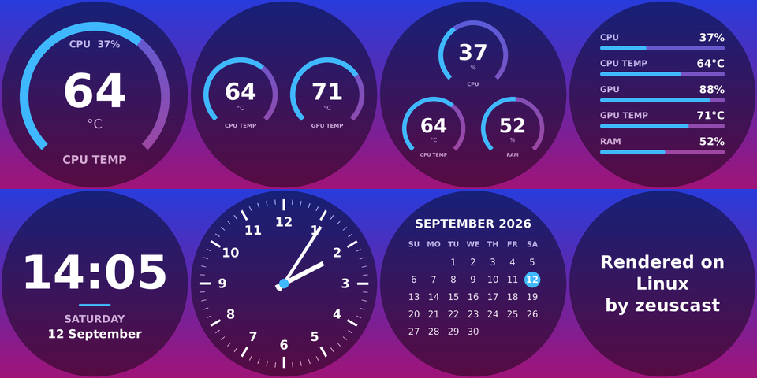
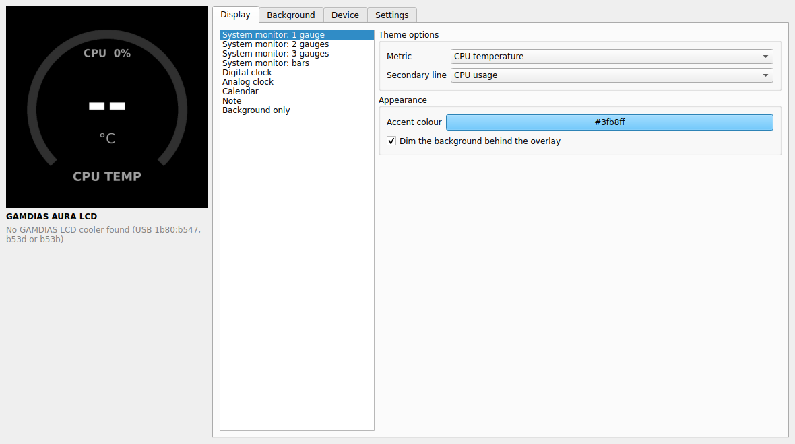

# zeuscast-linux

**Drive the LCD on GAMDIAS coolers from Linux.** An open-source replacement for
the Windows-only GAMDIAS **ZEUS CAST** app: live CPU/GPU stats, clocks, a
calendar, notes, and your own image or video background.



- **Themes:** 8 overlays (1–3 gauges, bars, digital or analog clock, calendar, note).
- **Backgrounds:** images, or videos and GIFs converted to the H.264 loop the cooler plays.
- **Panel settings:** brightness, rotation, startup screen, and the firmware's built-in clock.
- **Three ways to run it:** a Qt GUI with a live preview and tray icon, a headless systemd user service, or a scriptable CLI.
- **No kernel driver:** the cooler is a standard USB serial device.

> Not affiliated with or endorsed by GAMDIAS. The protocol was worked out from
> ZEUS CAST 1.4.3.39 for interoperability; no GAMDIAS code or artwork is included.

## Supported hardware

| USB ID      | Model (ZEUS CAST name) | Panel   | Status |
|-------------|------------------------|---------|--------|
| `1b80:b547` | AURA LCD               | 480×480 | handshake verified on real hardware (app V1.0.3, firmware V1.2.7) |
| `1b80:b53d` | CHIONE LCD             | 480×480 | same protocol, untested |
| `1b80:b53b` | BOREAS LCD             | 272×480 | same protocol, untested |

Check which one you have with `lsusb | grep 1b80`. Reports from other models are
very welcome; see [Contributing](#contributing).

## Install

### Fedora

```bash
git clone https://github.com/codentacos/zeus-cast-linux.git
cd zeus-cast-linux
bash install.sh
```

Then **unplug and replug the cooler's USB cable** so the udev rule applies.

`install.sh`:
- installs the dependencies with `dnf`
- adds a udev rule (`packaging/60-zeuscast.rules`) so your user can open the port and ModemManager leaves it alone
- installs zeuscast into a venv under `~/.local/share/zeuscast`
- adds an app-menu entry and a systemd user service

### Other distributions

You need:
- Python 3.10+
- `pyserial`, `Pillow` ≥ 10.1 and `psutil`
- `PySide6` for the GUI and `ffmpeg` for video backgrounds

Then:

```bash
pip install .[gui]
sudo install -m 0644 packaging/60-zeuscast.rules /etc/udev/rules.d/
sudo udevadm control --reload-rules    # then replug the cooler
```

## Usage

### GUI

```bash
zeuscast gui
```

Or open *ZEUS CAST for Linux* from the app menu.



- **Display:** the overlay theme and its options.
- **Background:** upload an image or video.
- **Device:** brightness, rotation, startup screen and the built-in clock.

The cooler forgets its background when it loses power, so zeuscast re-sends the
saved background every time it connects (turn this off under *Settings*). For
that to happen after a reboot, zeuscast has to start on its own: tick *Launch
when I log in*, or use the background service below.

Closing the window keeps it running in the tray so the stats stay live. GNOME
needs the AppIndicator extension for a tray; without one, closing the window
quits.

### Background service

Set things up once in the GUI (or with `zeuscast theme`), quit the GUI, then:

```bash
systemctl --user enable --now zeuscast
```

The service reloads `~/.config/zeuscast/config.json` whenever it changes, and
re-sends the saved background whenever it connects to the cooler (e.g. after a
reboot). Only
one program can use the cooler at a time, so stop the service before opening the
GUI.

### Command line

```bash
zeuscast list                                # find coolers
zeuscast info                                # firmware versions, brightness, …
zeuscast brightness 70
zeuscast rotate 180
zeuscast background ~/Pictures/wall.jpg      # or .mp4/.gif/.mov (trimmed to 30 s)
zeuscast theme dashboard --set metric5=fan
zeuscast theme note --set text="Hello" --set font_size=60
zeuscast clock 1                             # firmware clock layout A (0 = off)
zeuscast preview out.png --theme gauge3      # render offline, no device needed
zeuscast -v raw 'POST brightness 1' '{"value":50}'
```

**Themes:** `gauge1`, `gauge2`, `gauge3`, `dashboard`, `digital_clock`,
`analog_clock`, `calendar`, `note`, `background`

**Metrics:**
- CPU: `cpu_usage`, `cpu_temp`, `cpu_freq`
- GPU: `gpu_usage`, `gpu_temp`, `vram_usage`
- System: `ram_usage`, `disk_usage`, `net_down`, `net_up`, `fan`

**Where readings come from:**
- CPU temperature: `k10temp`, `zenpower` or `coretemp`
- NVIDIA GPUs: `nvidia-smi`
- AMD GPUs: amdgpu sysfs
- Fans: hwmon

## How it works

The cooler enumerates as a USB CDC-ACM serial port (`/dev/ttyACM*`, symlinked to
`/dev/gamdias-lcd` by the udev rule). Its display controller stores and plays a
background (JPEG or H.264 MP4) by itself. The host renders a transparent PNG
overlay and re-uploads it every couple of seconds. That's how ZEUS CAST shows
live stats, and zeuscast does the same.

**Framing:** `5A | length (2 bytes) | ASCII payload | checksum | 5A`. Inside the
frame, `5A` is escaped as `5B 01` and `5B` as `5B 02`.

**Payloads** are HTTP-like:

```
POST brightness 1\r\n
ContentType=json\r\n
ContentLength=12\r\n
\r\n
{"value":80}
```

**File uploads** take three steps: `POST transport` (name and size), the raw
bytes, then `POST transported` (MD5).

Newer firmware (app ≥ V1.0.10) also expects `SeqNumber` headers; zeuscast
detects this from the handshake.

[`zeuscast/protocol.py`](zeuscast/protocol.py) documents the framing, and
[`zeuscast/device.py`](zeuscast/device.py) lists every command.

### Project layout

```
zeuscast/
  protocol.py   framing, escaping, request/response parsing
  device.py     serial driver: handshake, settings, 3-step file upload
  engine.py     background worker: reconnects, renders and uploads overlays, follows sleep
  render.py     overlay themes (Pillow)
  sensors.py    CPU/GPU/RAM/network/fan readings
  media.py      background image/video preparation (Pillow, ffmpeg)
  gui.py        PySide6 settings window
  cli.py        command-line interface
packaging/      udev rule, systemd user service, desktop entry
tests/          unit tests with a simulated cooler
```

## Troubleshooting

- **Permission denied:** the udev rule isn't active. Check
  `/etc/udev/rules.d/60-zeuscast.rules` exists, then replug the cooler. As a
  fallback, run `sudo usermod -aG dialout $USER` and log out and back in.
- **"in use by another program":** another zeuscast (GUI or service) has the
  port. Run `systemctl --user stop zeuscast`.
- **No replies right after plugging in:** ModemManager may be probing the port.
  The udev rule tells it to ignore the device; replug after installing the rule.
- **"ffmpeg has no H.264 encoder":** install `ffmpeg` from RPM Fusion, or make
  sure `openh264` is available for `ffmpeg-free`.
- **The built-in clock is off by some hours:** the firmware assumes UTC+8, and
  zeuscast shifts local time the same way ZEUS CAST does. Please open an issue
  with your time zone.
- **Anything else:** run `zeuscast -v info` to log every request and reply, and
  include that output in an issue.

## Not ported (yet)

ZEUS CAST's weather, RSS, webcam and ChatGPT screens, and firmware updates.

## Contributing

Bug reports, and especially logs from CHIONE and BOREAS coolers, help most.
Include:
- `lsusb | grep 1b80`
- the output of `zeuscast -v info`
- your distro

Run the tests (no hardware needed):

```bash
python3 -m unittest discover -s tests -t . -v
```

## License

[MIT](LICENSE)
